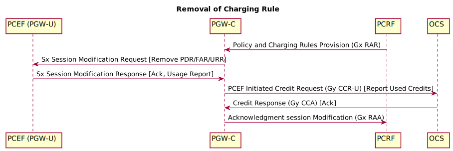
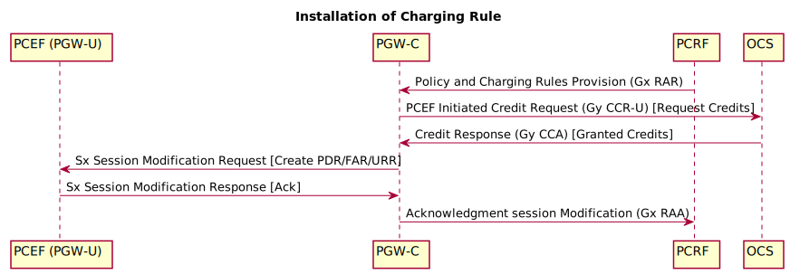
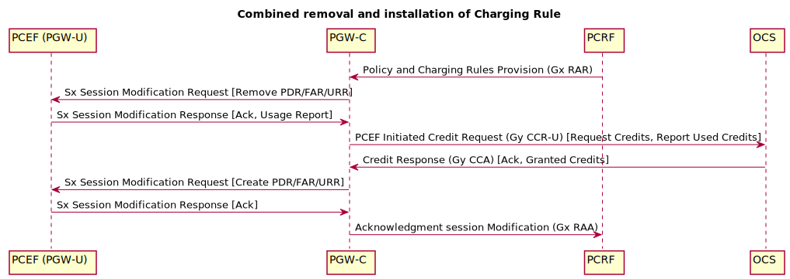

# 3GPP TS 23.203 and 23.214 procedures

## PCRF initialted IP-CAN session modification





# Definition:

   ~~[ Service-Identifier ]~~
   ~~[ Rating-Group ]~~
   * [ Flow-Information ]
   ~~[ Default-Bearer-Indication ]~~
   ~~[ TDF-Application-Identifier ]~~
   ~~[ Flow-Status ]~~
   ~~[ QoS-Information ]~~
   ~~[ PS-to-CS-Session-Continuity ]~~
   ~~[ Reporting-Level ]~~
   ~~[ Online ]~~
   ~~[ Offline ]~~
   ~~[ Max-PLR-DL ]~~
   ~~[ Max-PLR-UL ]~~
   [ Metering-Method ]             :: DURATION, VOLUME, DURATION_VOLUME (not EVENT) ????
   [ Precedence ]
   ~~[ AF-Charging-Identifier ]~~
   ~~[ Flows ]~~
   ~~[ Monitoring-Key]~~
   ~~[ Redirect-Information ]~~
   ~~[ Mute-Notification ]~~
   ~~[ AF-Signalling-Protocol ]~~
   ~~[ Sponsor-Identity ]~~
   ~~[ Application-Service-Provider-Identity ]~~
   ~~[ Required-Access-Info ]~~
   ~~[ Sharing-Key-DL ]~~
   ~~[ Sharing-Key-UL ]~~
   ~~[ Traffic-Steering-Policy-Identifier-DL ]~~
   ~~[ Traffic-Steering-Policy ]~~

# Flow-Information:

     [ Flow-Description ]          -> IPFilterRule
   ~~[ Packet-Filter-Identifier ]~~
   ~~[ Packet-Filter-Usage ]~~
   ~~[ ToS-Traffic-Class ]~~
   ~~[ Security-Parameter-Index ]~~
   ~~[ Flow-Label ]~~
    [ Flow-Direction ]             :: UPLINK, DOWNLINK (not supported UNSPECIFIED, BIDIRECTION)
   ~~[ Routing-Rule-Identifier ]~~


# Sample for Manual Decoding

```erlang
rr("/usr/lib/erlang/lib/diameter*/include/*").

Pkt1 = <<16#01,16#00,16#03,16#80,16#c0,16#00,16#01,16#10,
		 ...
		 16#40,16#00,16#00,16#0c,16#00,16#00,16#00,16#02>>.


Opts1 = #{app_dictionary => diameter_3gpp_ts32_299_ro,
	  decode_format => maps,
	  string_decode => false,
	  strict_mbit => true,
	  rfc => 6733,
	  failed_avp => false}.
#diameter_packet{msg = Msg1} = diameter_codec:decode(diameter_3gpp_ts32_299_ro, Opts1, Pkt1).
rp(Msg1).
```
